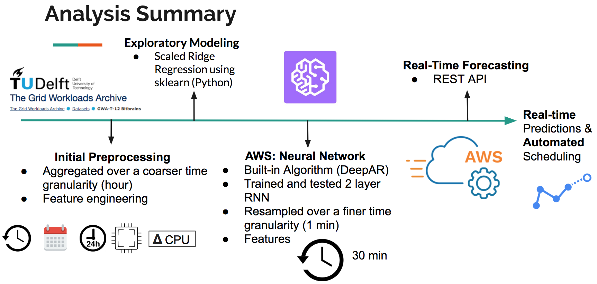

## Project Summary
As a Data analyst, my objective was to understand the client's needs to help them achieve their goals. The client sought insights into their current network resource usage and provisioning. Additionally, they aimed to adopt a machine learning approach to enable real-time usage predictions and automate provisioning schedules. This shift was crucial because they were dedicating significant time to manually setting resource limits, maintaining consistently high resource thresholds to minimize downtime (i.e., system crashes). Historically, organizations face the challenge of balancing the cost of CPU bandwidth with the need to prevent downtime by slightly over-provisioning. This trend was evident in the publicly available dataset I used for my data analysis, as an NDA agreement was in place. Therefore, my role was to develop a model that would provide more intelligent predictions of resource usage.

Here is how I translated Manifold’s business objectives into an actionable deliverable.

First, I used time-series analysis, advanced regression techniques, and time series cross-validation in Python (using sklearn) to characterize resource usage as well as to identify important predictive features.

Next, I implemented DeepAR, a recently developed built-in algorithm from Amazon Sagemaker (hosted on AWS) to help shift towards real-time analytics. Amazon SageMaker DeepAR is a supervised learning algorithm used to forecast time series using recurrent neural networks (RNN). 

## Overview of my analysis pipeline:

## Notebook Organization

1. [TimeSeries_Models.py](https://github.com/Kannupriya1999/Forecasting-Model/blob/main/Manifold_TimeSeries_Models.py.ipynb): - Modeling 500 time series using sklearn. Techniques include feature engineering, rolling window averages (smoothing), linear regression, scaled regression, and lasso, and ridge regression to perform feature selection and reduce overfitting.

2. [AWS_DeepAR](https://github.com/Kannupriya1999/Forecasting-Model/blob/main/Manifold_AWS_DeepAR.py.ipynb): AWS Jupyter notebook for Sagemaker DeepAR. Includes code to download and read in data, format into JSON strings, push to S3 bucket, create train a recurrent neural network (RNN), and visualize model predictions. 

3. [Visualize_Initial_Explore.py.ipynb](https://github.com/Kannupriya1999/Forecasting-Model/blob/main/Manifold_Visualize_Initial_Explore.py.ipynb): - Includes some initial visualizations of data (aggregated and resampled hourly) using python and matplotlb.

4. [Timeseries_FirstLook_1month.py.ipynb](https://github.com/Kannupriya1999/Forecasting-Model/blob/main/Manifold_FirstLook_1month.py.ipynb) - Contains code for exploring timeseries from 1 month and 100 VMs. Includes initial models using ARIMA, SARIMAX, Holt-Winters (smoothing), some visualizations, and stationarity tests.

